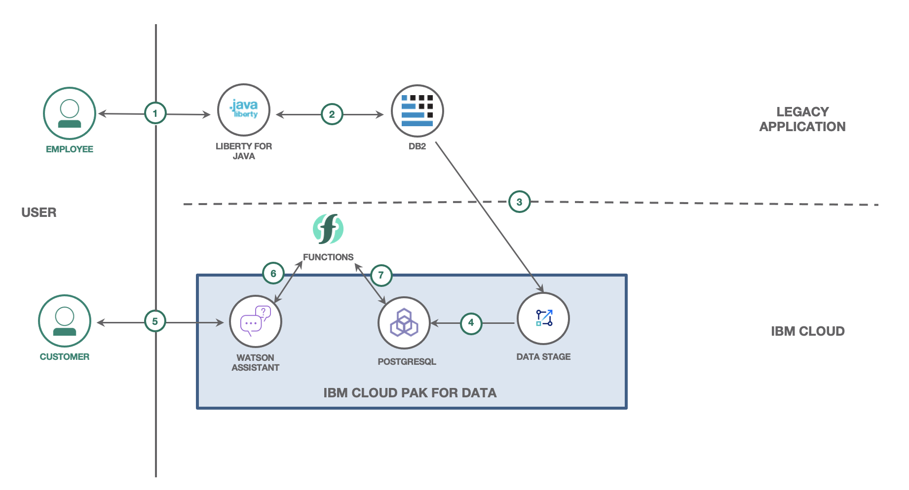
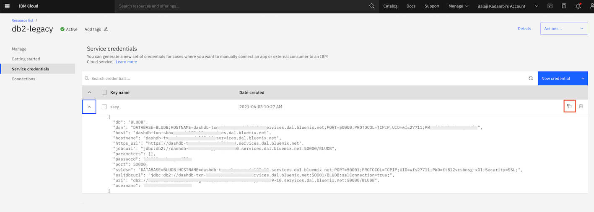

(WORK IN PROGRESS)
# Modernize a legacy application using a co-existence layer 

App modernization is the process of improving your current applications - or building entirely new ones - to take advantage of new, innovative tech. There needs to be a practical approach to move your legacy applications to new technologies without disrupting the current operations. Legacy applications could be a monolith with tightly coupled modules. The move to new technologies needs to be an incremental approach.

In this code pattern, we will take the scenario of a telecom company that provides mobile network services. The company has a legacy application with a number of functional modules for customer information management, mobile plans management, inventory management and billing. The telecom company now wants to build a new system of engagement with an interactive chatbot for the customers. In the new chatbot the customers can query for billing information, data usage and also get plan recommendations. It is proposed to build this new chatbot using new technologies but without disrupting the existing legacy system. The legacy system uses a DB2 database and is the system of record. The new chatbot system uses a Postgresql database. A subset of data needed by the chatbot system is replicated to the Postgresql database using [IBM Data Stage](https://www.ibm.com/in-en/products/infosphere-datastage).

When you have completed this code pattern, you will understand how to:
- Create Datastage flows and jobs for data replication
- Create a chatbot using Watson Assistant
- Create cloud functions in Watson Assistant to query databases

## Flow



1. The employee performs one of many actions like create new mobile plan, enter new customer information or generate billing for customers.
2. The data is stored in the DB2 database.
3. Datastage reads data from DB2 database.
4. Datastage replicates the data in the Postgresql database.
5. A customer queries for billing information, data usage and recommendations.
6. Watson Assistant invokes Cloud Functions for the queries.
7. Cloud functions queries Postgresql for data, processes the data and returns the response to Watson Assistant.

## Prerequisites
1. [IBM Cloud Account](https://cloud.ibm.com)
1. [IBM Cloud CLI](https://cloud.ibm.com/docs/cli?topic=cli-getting-started)
1. [IBM Cloud Pak for Data](https://cloud.ibm.com/catalog/content/ibm-cp-datacore-6825cc5d-dbf8-4ba2-ad98-690e6f221701-global)
3. [Java](https://www.java.com/en/)
4. [Maven](https://maven.apache.org/)

## Steps

1. [Create an instance of DB2 database](#1-create-an-instance-of-db2-database)
2. [Clone the repo](#1-clone-the-repo)
3. [Build and deploy the legacy application](#1-build-and-deploy-the-legacy-application)

## 1. Create an instance of DB2 database

Login to IBM Cloud:
```
ibmcloud login [--sso]
```

Run the below command to create an instance of DB2:
```
ibmcloud resource service-instance-create db2-legacy dashdb-for-transactions free us-south
```

The DB2 instance is created and the output appears as shown below:
```
Creating service instance db2-legacy in resource group default of account Balaji Kadambi's Account as bkadambi@in.ibm.com...
OK
Service instance db2-legacy was created.
                     
Name:             db2-legacy   
ID:               crn:v1:bluemix:public:dashdb-for-transactions:us-south:a/9xxxxb::   
GUID:             xxxx   
Location:         us-south   
State:            active   
Type:             service_instance   
Sub Type:            
Allow Cleanup:    false   
Locked:           false   
Created at:       2021-06-03T04:52:38Z   
Updated at:       2021-06-03T04:52:38Z   
Last Operation:                   
                  Status    create succeeded      
                  Message   Completed create instance operation   
```
Make a note of the GUID. It is needed in the next step.

Run the below command to create service credentials:
```
ibmcloud resource service-key-create skey --instance-id [GUID of DB2]
```

## 2. Clone the repo

Run the below command to clone the repo:
```
git clone https://github.com/IBM/app-modernization-coexistence-layer.git
```

## 3. Build and deploy the legacy application

Open IBM Cloud Dashboard. Go to the `db2-legacy` database instance you created earlier. Select `Service credentials` on the menu. Copy the DB2 credentials by clicking on the `Copy to clipboard` icon. This needs to be added to the `credentials-db2.json` file.



In the cloned Github repo, go to the `resources` folder:
```
cd app-modernization-coexistence-layer/sources/legacyapp/src/main/resources/
```

Open the `credentials-db2.json` file and paste the DB2 credentials you copied earlier.

Go to the `legacypp` folder:
```
cd ../../..
```

Run the below command to build the application:
```
mvn clean install
```

Deploy the legacy application to IBM Cloud:
```
ibmcloud cf push
```
>Note: In a real world situation, the legacy application runs on-premise. The application is deployed to IBM Cloud so that it is accessible for demonstrating the code pattern.

You will see the below ouput at the end when the application starts fine:
```
Waiting for app to start...

name:              app-legacy
requested state:   started
routes:            app-legacy-xxxx.mybluemix.net
last uploaded:     Thu 03 Jun 09:44:06 IST 2021
stack:             cflinuxfs3
buildpacks:        Liberty for Java(TM) (WAR, liberty-21.0.0_3,
                   buildpack-v3.57-20210512-1446, ibmjdk-1.8.0_sr6fp26-20210216,
                   env)

type:            web
instances:       1/1
memory usage:    512M
start command:   .liberty/initial_startup.rb
     state     since                  cpu     memory           disk         details
#0   running   2021-06-03T04:15:35Z   92.7%   176.3M of 512M   332M of 1G   
```

Make a note of the route(app-legacy-xxxx.mybluemix.net) in the output. 

Please check if the application is accessible at http://app-legacy-xxxx.mybluemix.net/telecom.

## Login to CP4D SaaS offering and Create Services

Access https://dataplatform.cloud.ibm.com/registration/stepone?context=cpdaas&apps=all to access CP4D SaaS offering. Select a region preferrably Dallas as DataStage service exists only in Dallas and Frankfurt region at the time of writing this code pattern. You must be having an active IBM Cloud account by now, so click on `Log in with your IBMid`. It sets up the core services of Cloud Pak for you. Launch the SaaS offering by clicking `Go to IBM Cloud Pak for Data`. It takes you to the integrated dashboard where you can create projects and work with your data.

On this dashboard, click on the Hamburger menu and navigate to Services Catalog under Services. It shows the list of integrated services.

Create the following services:
* **Databases for PostgreSQL**

> Note: This code pattern uses PostgreSQL DB for the modernized application. You can setup your own PostgreSQL DB and provide connection details or use the service provided on IBM Public Cloud as shown here.

  On the services catalog page, select `Databases` in Category, it will show list of available databases of which instance can be created on IBM Cloud. Choose `Database for PostgreSQL`. Provide the required values like region, service name, resource group. Rest all values are optional. You can proceed with the default values and click `Create`. Post this, it will create service instance on IBM Cloud and allows you to add more services. Click on `Add Service` and perform the steps as exaplined in next section.
  
* **Cloud Object Storage (COS)**

  On the services catalog page, select `Storage` in Category and choose Cloud Object Storage. Choose the pricing plan, resource group and provide the service name, then click `Create`. Note that you can use `Lite` plan of this service for this code pattern. COS is required to save your assets and project details which we will be creating in later steps. Click on `Add Service` and perform the steps as exaplined in next section.
  
* **DataStage**

  On the services catalog page, select `Analytics` in Category and choose DataStage. Select the region, resource group and provide the service name of your choice, then click `Create`. Note that you can use `Lite` plan of this service for this code pattern. This instance will be used to create DataStage flows for data replication. Click on `Add Service` and perform the steps as exaplined in next section.
  
* **Watson Assistant**

  On the services catalog page, select `AI/Machine Learning` in Category and choose Watson Assistant. Select the region, resource group and provide the service name, then click `Create`. Note that you can use `Lite` plan of this service for this code pattern.
  
You have created all the required services of CP4D for this code pattern. You can read more about CP4D SaaS offering [here](https://www.ibm.com/products/cloud-pak-for-data/as-a-service). Now, click on the hamburger menu and navigate to Home.


