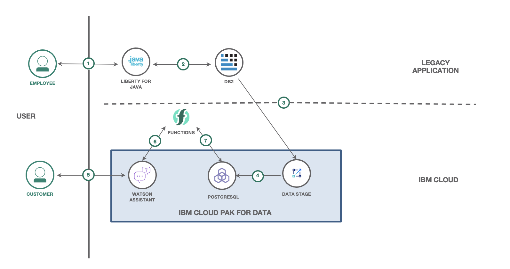

(WORK IN PROGRESS)
# Modernize a legacy application using a co-existence layer 

App modernization is the process of improving your current applications - or building entirely new ones - to take advantage of new, innovative tech. There needs to be a practical approach to move your legacy applications to new technologies without disrupting the current operations. Legacy applications could be a monolith with tightly coupled modules. The move to new technologies needs to be an incremental approach.

In this code pattern, we will take the scenario of a telecom company that provides mobile network services. The comany has a legacy application with a number of functional modules for customer information management, mobile plans management, inventory management and billing. The telecom company now wants to build a new system of engagement with an interactive chatbot for the customers. In the new chatbot the customers can query for billing information, data usage and also get plan recommendations. It is proposed to build this new chatbot using new technologies but without disrupting the existing legacy system.


## Flow




## Prerequisites
1. [IBM Cloud Account](https://cloud.ibm.com)
1. [IBM Cloud CLI](https://cloud.ibm.com/docs/cli?topic=cli-getting-started)
1. [Java](https://www.java.com/en/)
1. [Maven](https://maven.apache.org/)

## Steps

1. [Create an instance of DB2 database](#1-create-an-instance-of-db2-database)

## 1. Create an instance of DB2 database

Login to IBM Cloud:
```
ibmcloud login [--sso]
```

Run the below command to create an instance of DB2:
```
ibmcloud resource service-instance-create db2-legacy dashdb-for-transactions free us-south
```

The DB2 instance is created and the output appears as shown below:
```
Creating service instance db2-legacy in resource group default of account Balaji Kadambi's Account as bkadambi@in.ibm.com...
OK
Service instance db2-legacy was created.
                     
Name:             db2-legacy   
ID:               crn:v1:bluemix:public:dashdb-for-transactions:us-south:a/9xxxxb::   
GUID:             xxxx   
Location:         us-south   
State:            active   
Type:             service_instance   
Sub Type:            
Allow Cleanup:    false   
Locked:           false   
Created at:       2021-06-03T04:52:38Z   
Updated at:       2021-06-03T04:52:38Z   
Last Operation:                   
                  Status    create succeeded      
                  Message   Completed create instance operation   
```
Make a note of the GUID. It is needed in the next step.

Run the below command to create service credentials:
```
ibmcloud resource service-key-create skey --instance-id [GUID of DB2]
```
